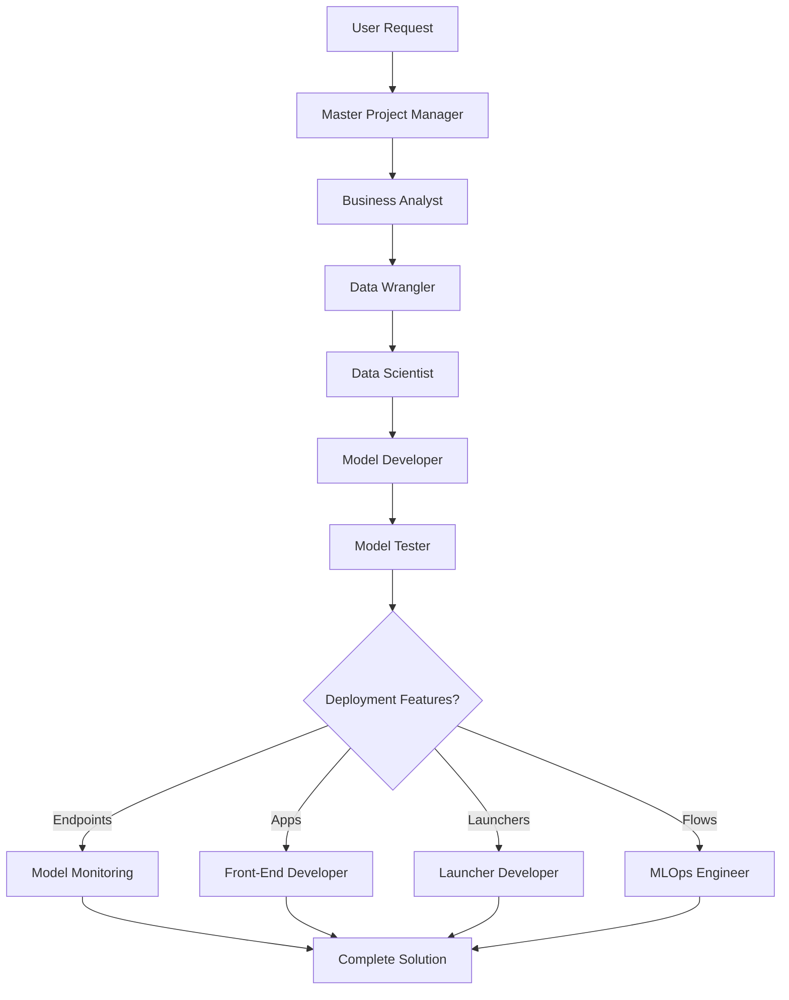

# Domino Data Lab Claude Code Agents

## Overview

This collection of Claude Code agents provides comprehensive support for building end-to-end machine learning demonstrations on the Domino Data Lab platform. Each agent specializes in a specific aspect of the ML lifecycle, and they work together to create production-ready solutions.

## Agent Categories

### 🎯 Orchestration
- **Master-Project-Manager-Agent** (purple)
  - Orchestrates complete ML pipelines with governance compliance
  - Coordinates all sub-agents for optimal workflow execution
  - Manages project state, dependencies, and approval workflows
  - Ensures proper data storage patterns across all agents

### 📊 Data & Analysis
- **Data-Wrangler-Agent** (red)
  - Acquires data from public/private sources or generates synthetic data
  - Manages data quality, validation, and pipeline development
  - Uses environment-adaptive data storage paths

- **Data-Scientist-Agent** (blue)
  - Performs exploratory data analysis and statistical modeling
  - Creates interactive visualizations and dashboards
  - Generates insights and feature engineering recommendations

### 🤖 Model Development & Testing
- **Model-Developer-Agent** (orange)
  - Develops, trains, and optimizes ML models
  - Implements hyperparameter tuning and model comparison
  - Registers best models with MLflow

- **Model-Tester-Agent** (purple)
  - Comprehensive model testing (functional, performance, fairness)
  - Validates compliance with regulatory requirements
  - Tests edge cases and robustness
  - Generates detailed test reports

### 🚀 Deployment & Operations
- **MLOps-Engineer-Agent** (yellow)
  - Creates deployment pipelines and automation workflows
  - Implements monitoring and alerting systems
  - Designs A/B testing frameworks
  - Ensures governance-compliant deployments

- **Model-Monitoring-Agent** (magenta)
  - Creates Domino Model API endpoints with monitoring
  - Implements DataCaptureClient for prediction logging
  - Configures drift detection and model quality metrics
  - Programmatically registers endpoints via Domino REST API

### 🎨 User Experience
- **Front-End-Developer-Agent** (cyan)
  - Builds user interfaces and interactive dashboards
  - Provides technology stack recommendations
  - Creates Domino Apps (Streamlit, Dash, Gradio)

- **Launcher-Developer-Agent** (teal)
  - Creates Domino Launchers for self-service execution
  - Implements parameter-driven workflows
  - Builds custom reporting and result handling

### 💼 Business & Requirements
- **Business-Analyst-Agent** (green)
  - Translates business needs into technical requirements
  - Defines success metrics and KPIs
  - Assesses governance framework applicability
  - Conducts regulatory research and compliance analysis

### 📚 Reference Documentation
- **Agent-Interaction-Protocol**
  - Communication patterns between agents
  - Coordination rules and best practices

- **Example-Demonstration-Flows**
  - Sample workflows and file organization patterns
  - MLflow integration examples

## Typical Workflow



## Data Storage Best Practices

**CRITICAL:** All agents use `/mnt/code/scripts/data_config.py` to determine correct storage paths.

### Storage Patterns by Project Type

**Git-based Projects** (DOMINO_WORKING_DIR=/mnt/code):
```
Code:      /mnt/code/              (Git-synced)
Data:      /mnt/data/{project}/    (Datasets, not in Git)
Artifacts: /mnt/artifacts/         (Models, reports)
```

**DFS Projects** (DOMINO_WORKING_DIR=/mnt):
```
Code:      /mnt/code/
Data:      /domino/datasets/local/{project}/
Artifacts: /mnt/
```

### Usage Example

```python
# Import the data_config utility
import sys
sys.path.insert(0, '/mnt/code')
from scripts.data_config import get_data_paths

# Get correct paths for your project
paths = get_data_paths('my_project')
data_dir = paths['base_data_path']      # Where to store datasets
artifacts_dir = paths['artifacts_path']  # Where to store models/reports

# Save data
train_csv = data_dir / 'train.csv'
df.to_csv(train_csv, index=False)

# Save model
model_path = artifacts_dir / 'models' / 'my_model.pkl'
model_path.parent.mkdir(parents=True, exist_ok=True)
joblib.dump(model, model_path)
```

**Never store data in `/mnt/code/data/` for Git-based projects** - this bloats the repository!

## File Organization

Standard directory structure:

```
/mnt/code/
├── src/                    # Production Python code
│   ├── api/               # API endpoints and serving
│   ├── models/            # Model training scripts
│   ├── monitoring/        # Monitoring dashboards
│   └── data/              # Data generation scripts
├── scripts/                # Utility scripts
│   └── data_config.py     # Data path configuration utility
├── notebooks/              # Jupyter notebooks
├── config/                 # Configuration files
├── tests/                  # Test files
└── docs/                   # Documentation

/mnt/artifacts/             # Git-based: Models, reports, visualizations
/mnt/data/{project}/        # Git-based: Dataset storage
/domino/datasets/local/{project}/  # DFS: Dataset storage
```

## Getting Started

### Basic Usage

1. **Simple Model Development**:
   - Start with Data-Wrangler-Agent to acquire data
   - Use Data-Scientist-Agent for EDA
   - Deploy Model-Developer-Agent for training
   - Test with Model-Tester-Agent

2. **Full Pipeline with Deployment**:
   - Use Master-Project-Manager-Agent
   - Agent will ask two questions upfront:
     1. **Which Domino features?** (Endpoints, Apps, Launchers, Flows, All, or None)
     2. **How much research time?** (Quick 2-3 min, Standard 5-7 min, Thorough 10-15 min, or Custom)
   - Agent conducts time-limited research and presents a plan
   - After presenting the plan, agent asks:
     3. **Execution mode?** (Step-by-step approval or Full automation)
   - It will orchestrate all necessary agents according to your execution preference

### Example Commands

```python
# Quick automated demo with all features
"Build a credit risk model with endpoint, dashboard, and launcher"
→ Agent asks: Features? Research time?
→ You: "All features, quick research"
→ Agent: 2-3 min research, presents plan
→ Agent asks: Step-by-step or Automated?
→ You: "Automated"
→ Agent: Builds complete system automatically

# Thorough compliance project with step-by-step review
"Create a fraud detection system for financial institution"
→ Agent asks: Features? Research time?
→ You: "Endpoints and Apps, thorough research for compliance"
→ Agent: 10-15 min deep research including regulations, presents plan
→ Agent asks: Step-by-step or Automated?
→ You: "Step-by-step - I need to review each stage"
→ Agent: Pauses before each milestone for approval

# Fast automated training
"Train a customer churn model"
→ Agent asks: Features? Research time?
→ You: "None, standard research"
→ Agent: 5-7 min research, presents plan
→ Agent asks: Step-by-step or Automated?
→ You: "Automated"
→ Agent: Executes training pipeline automatically

# Specific component tasks (individual agents - no execution mode needed)
"Generate synthetic financial data for fraud detection"  # Data-Wrangler-Agent
"Perform EDA on this dataset and create visualizations"  # Data-Scientist-Agent
"Deploy this model as a Domino Model API with monitoring"  # Model-Monitoring-Agent
"Create a Streamlit app for model predictions"  # Front-End-Developer-Agent
```

## Key Features

### MLflow Integration
- All agents log experiments, metrics, and artifacts to MLflow (http://localhost:8768)
- Parent-child run hierarchy for complex workflows
- Model registry with signatures and input examples
- Comprehensive tracking of all pipeline stages

### Domino Platform Features
- **Model APIs**: REST endpoints with monitoring and drift detection
- **Apps**: Interactive dashboards (Streamlit, Dash, Gradio)
- **Launchers**: Self-service parameter-driven execution
- **Flows**: Automated ML pipeline orchestration
- **Datasets**: Centralized data storage and versioning

### Technology Stack
- **Primary Language**: Python for all ML operations
- **ML Frameworks**: scikit-learn, XGBoost, LightGBM, TensorFlow, PyTorch
- **UI Frameworks**: Streamlit, Dash, Gradio, Panel, React/FastAPI
- **Deployment**: FastAPI, Flask, Docker, Domino infrastructure

### Error Handling
- Graceful degradation with fallback strategies
- Comprehensive logging and monitoring
- Retry logic with exponential backoff
- Clear error messages and remediation steps

## Output Standards

Each agent produces:
- Python scripts and notebooks with documentation
- MLflow experiments with full tracking
- Test data and validation results
- Deployment-ready artifacts
- Comprehensive documentation

## Execution Mode Guide

The **Master-Project-Manager-Agent** offers two execution modes after presenting the project plan:

### Step-by-Step Approval Mode
- **When to use**: Learning, demonstrations, quality control, customization
- **How it works**: Agent pauses before each major milestone and asks for approval
- **Milestones**: Data generation → EDA → Model training → Testing → Each deployment component
- **Benefits**: Full control, can modify plan on the fly, educational
- **Example**: "Step-by-step - I want to review each stage"

### Full Automation Mode
- **When to use**: Speed, trusted workflows, standard implementations
- **How it works**: Agent executes entire plan without interruption
- **Benefits**: Faster execution, minimal supervision, consistent results
- **Pauses only**: If critical errors occur
- **Example**: "Automated - just do it"

**Default**: If not specified, agent defaults to **Step-by-Step Approval** (safer option)

## Best Practices

1. **Always use `get_data_paths()`** to determine storage locations
2. **Never store data in `/mnt/code/data/`** for Git-based projects
3. **Specify project name** for proper organization
4. **Include business context** for better recommendations
5. **Choose execution mode** based on your needs (step-by-step for learning, automated for speed)
6. **Use descriptive experiment names** in MLflow
7. **Enable monitoring** for production deployments

## Agent Selection Guide

| Use Case | Recommended Agent |
|----------|------------------|
| Generate synthetic data | Data-Wrangler-Agent |
| Explore and visualize data | Data-Scientist-Agent |
| Train multiple models | Model-Developer-Agent |
| Validate model quality | Model-Tester-Agent |
| Create REST API endpoint | Model-Monitoring-Agent |
| Build dashboard | Front-End-Developer-Agent |
| Create self-service tool | Launcher-Developer-Agent |
| Automate ML pipeline | MLOps-Engineer-Agent |
| Complete end-to-end project | Master-Project-Manager-Agent |
| Translate business requirements | Business-Analyst-Agent |

## Tips for Sales Engineers

- Start with **Master-Project-Manager-Agent** for complete demos
- Use individual agents for specific customer pain points
- Leverage **Front-End-Developer-Agent's** technology recommendations
- Always generate test data with **Data-Wrangler-Agent**
- Use **Model-Tester-Agent** to showcase governance capabilities
- Demonstrate monitoring with **Model-Monitoring-Agent**
- Show self-service with **Launcher-Developer-Agent**

## Governance & Compliance

All agents support:
- NIST Risk Management Framework (RMF)
- Model Risk Management V3
- Ethical AI Framework
- Fair Lending compliance (ECOA, FCRA)
- Basel III, Dodd-Frank requirements

Agents automatically:
- Exclude protected attributes from models
- Validate fairness metrics
- Generate compliance documentation
- Coordinate approval workflows

## Dependencies

Core Python packages required:
```
pandas, numpy, scikit-learn
mlflow, optuna, joblib
streamlit, dash, gradio
fastapi, flask
xgboost, lightgbm
plotly, seaborn, matplotlib
domino-data-capture
```

## Additional Resources

- Review `Agent-Interaction-Protocol.md` for communication patterns
- Check `Example-Demonstration-Flows-With-File-Structure.md` for workflow examples
- See `/mnt/code/CLAUDE.md` for complete project guidelines
- Each agent file contains detailed system prompts and key methods
- All agents follow Domino Data Lab best practices

## Version History

- **v3.0**: Added data storage standardization with `data_config.py`
- **v2.0**: Added Model-Monitoring-Agent and Launcher-Developer-Agent
- **v1.0**: Initial agent collection
